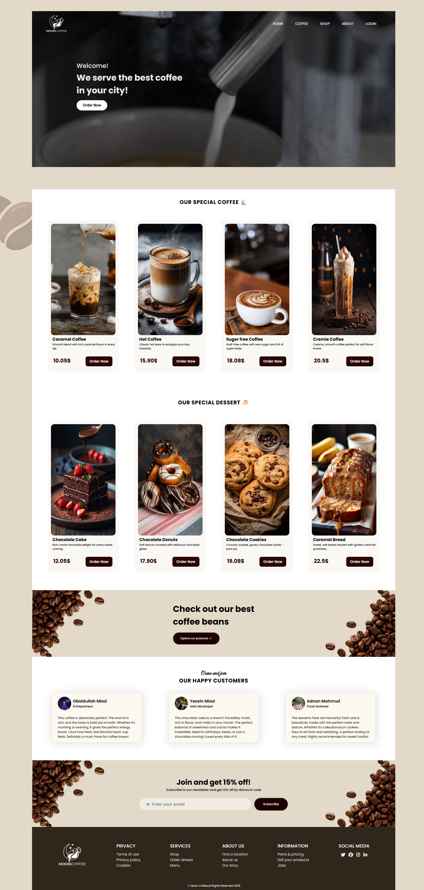

# ​ Coffee Shop Landing Page

This is a **coffee-themed landing page** project built exclusively using **HTML5** and **CSS3**.  
It's designed to be **clean**, **responsive**, and **visually inviting** — perfect for showcasing a cozy café or coffee brand online.

---

##  Table of Contents
- [About](#about)
- [Demo](#demo)
- [Features](#features)
- [Technologies](#technologies)
- [Installation](#installation)
- [Usage](#usage)
- [Screenshots](#screenshots)
- [License](#license)
- [Contact](#contact)

---

##  About
This project simulates a modern landing page for a coffee shop, featuring:
- A welcoming **Hero Section** with coffee imagery and call-to-action
- **Menu Preview** or feature highlights
- **About** or story section
- **Testimonials** or customer feedback
- A neat **Footer** with contact details and links

This is primarily a practice project to sharpen your front-end design skills and build a portfolio-ready piece.

---

##  Demo
🔗 **Live Demo:** https://obaidullah-miazi-dev.github.io/coffee-shop-landing-page/

---

##  Features
- Fully responsive across desktop, tablet, and mobile
- Elegant and minimal typography
- Clear, section-based layout: Hero → Menu/About → Testimonials → Footer
- Styled buttons and hover effects for interactivity

---

##  Technologies
- **HTML5**
- **CSS3** (including Flexbox, Grid, and Media Queries)

---

##  Installation
To run the project locally:

```bash
# Clone the repository
git clone https://github.com/obaidullah-miazi-dev/coffee-shop-landing-page.git

# Navigate into project folder
cd coffee-shop-landing-page

# Open index.html in your browser
open index.html

```

## Usage

Open index.html in your favorite browser to view the landing page.
Resize the browser or use device simulation mode to test responsiveness.

##Screenshots
Full Desktop View



## License

This project is available under the MIT License.
Feel free to use, modify, or distribute — just don’t forget to give proper credit.

## Contact

GitHub:(https://github.com/obaidullah-miazi-dev)
LinkedIn: (http://www.linkedin.com/in/obaidullah-miazi)
Email: (obaidullahmiazi.dev@gmail.com)